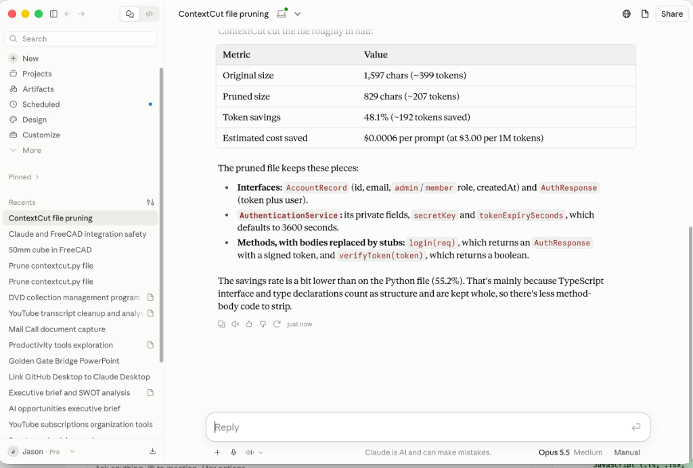
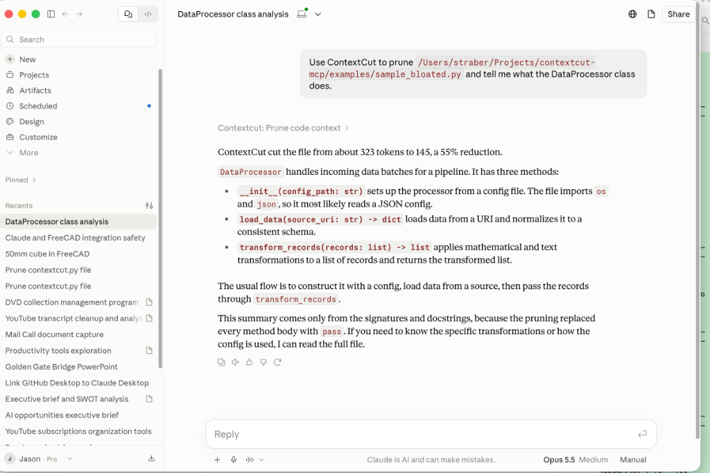

# ContextCut MCP Server (v1.3.0 - Polyglot & ROI Analytics)

[](https://5tra83rstudios.com)
[](LICENSE)
[](https://modelcontextprotocol.io)
[](https://python.org)
[](https://nodejs.org)

**ContextCut** is a local-first, AST-based code context pruner for LLMs and AI coding agents (Claude Desktop, Cursor, Antigravity, Roo Code) via the **Model Context Protocol (MCP)**.

It parses Python and TypeScript/JavaScript files and directories, stripping out internal function and method bodies down to stubs while retaining 100% of signatures, interfaces, type hints, dataclasses, and docstrings.

---

## 📸 Verified Live in Claude Desktop

| TypeScript AST Pruning (48.1% Token Reduction) | Python Architecture Analysis (55.2% Token Reduction) |
| :---: | :---: |
|  |  |

---

## ⚡ What it Does

```python
# Before ContextCut (~350 tokens of internal loops, regex, and logging):
def process_data(uri: str) -> dict:
    """Loads and normalizes schema."""
    if not uri:
        raise ValueError("Invalid")
    # ... 40 lines of heavy implementation logic ...
    return result

# After ContextCut (~35 tokens, 90% reduction):
def process_data(uri: str) -> dict:
    """Loads and normalizes schema."""
    pass
```

### Real-Time Telemetry Header
Every pruned output automatically injects an instant token and cost savings summary:

```python
"""
[ContextCut Telemetry]
----------------------------------------
Files Pruned:   3
Original Size:  14,250 chars (~3,562 tokens)
Pruned Size:    3,810 chars (~952 tokens)
Token Savings:  73.3% reduction (~2,610 tokens saved)
Est. Cost Saved: $0.0078 per prompt (@ $3.00/1M tokens)
----------------------------------------
"""
```

---

## 📊 Persistent ROI Analytics & Reporting (New in v1.3.0)

ContextCut automatically records cumulative token and dollar savings to a private, local append-only ledger at `~/.contextcut/history.jsonl`. 

* **100% Local & Private**: Only anonymous token counts and timestamps are logged. No source code or prompts ever leave your machine.
* **Quantifiable ROI**: Generate aggregated cost-benefit reports on any interval (daily, weekly, monthly, or all-time).

### Terminal CLI Report:
```bash
# View all-time savings report
node build/index.js report

# View weekly report
node build/index.js report --interval=weekly

# Raw JSON output for custom dashboards
node build/index.js report --interval=monthly --json
```

---

## 🚀 Quick Start

### 1. Install & Build
```bash
git clone https://github.com/5tra83r/contextcut-mcp.git
cd contextcut-mcp
npm install
npm run build
```

> **Zero-Friction Runtime**: ContextCut automatically detects your environment. If a compiled binary in `./bin/contextcut` is present, it uses it; otherwise, it seamlessly falls back to your local `python3` installation.

### 2. Connect to MCP Clients

#### Claude Desktop
Add to `~/Library/Application Support/Claude/claude_desktop_config.json`:
```json
{
  "mcpServers": {
    "contextcut": {
      "command": "node",
      "args": ["/ABSOLUTE/PATH/TO/contextcut-mcp/build/index.js"]
    }
  }
}
```

#### Antigravity / Cursor
Configure in your project's `.agents/` or MCP settings:
```json
{
  "mcpServers": {
    "contextcut": {
      "command": "node",
      "args": ["/ABSOLUTE/PATH/TO/contextcut-mcp/build/index.js"]
    }
  }
}
```

---

## 🛠 Available Tools, Prompts & Resources

### Tool: `prune_code_context`
* `target_path`: Path to a source file or directory (Python, TypeScript, or JavaScript).
* `code_content`: Optional raw code string to prune directly in-memory.
* `language`: Optional language hint (`"python"`, `"typescript"`, or `"javascript"`).
* `glob_pattern`: Optional filter for directory scans (default: `*.py` or `*.ts`).
* `depth`:
  * `"interfaces_only"` (default): Preserves docstrings, signatures, and types.
  * `"minimal"`: Strips docstrings for maximum token compression.

### Tool: `get_savings_report`
Generates an aggregated cost-benefit ROI report over a specified interval.
* `interval`: `"daily"`, `"weekly"`, `"monthly"`, or `"all_time"` (default: `"all_time"`).
* `format`: `"markdown"` (default) or `"json"`.

### Tool: `check_license`
Validates license tier status (Free Core vs Pro Polyglot).

### Prompt: `analyze_architecture`
Guides your AI agent to inspect a repository's high-level architecture using pruned interface stubs without getting lost in implementation noise.

### Resource: `contextcut://pruned/{filepath}`
Exposes on-demand pruned stubs as native MCP readable resources.

### Prompt: `analyze_architecture`
Guides your AI agent to inspect a repository's high-level architecture using pruned interface stubs without getting lost in implementation noise.

### Resource: `contextcut://pruned/{filepath}`
Exposes on-demand pruned stubs as native MCP readable resources.

---

## 🧪 Testing

Run the automated test suite:
```bash
npm test
# Or: python3 -m unittest discover -s tests
```

---

## 💼 Business & Monetization
See [MONETIZATION.md](MONETIZATION.md) for the complete Go-To-Market roadmap, Lemon Squeezy payment integration, and community registry launch guide.

---

## 📄 License
© 2026 5tra83r Studios. All rights reserved.
